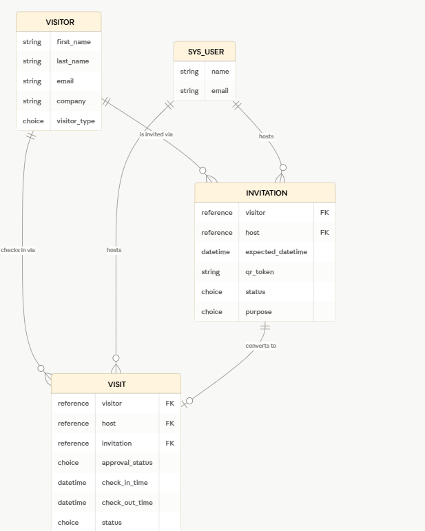
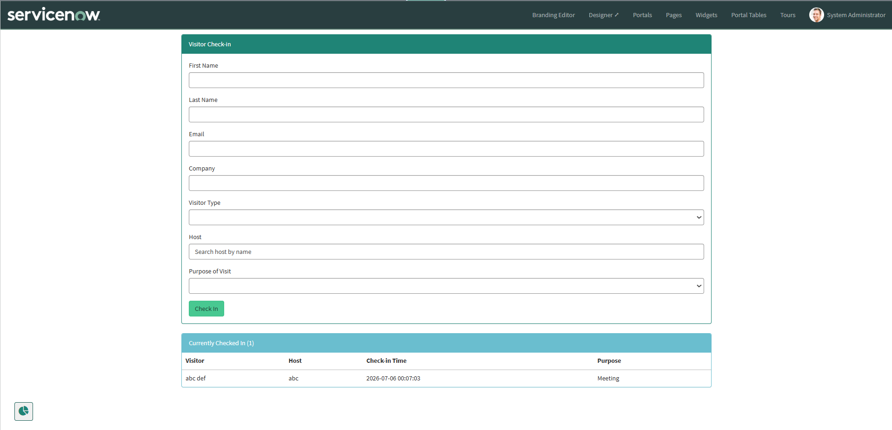
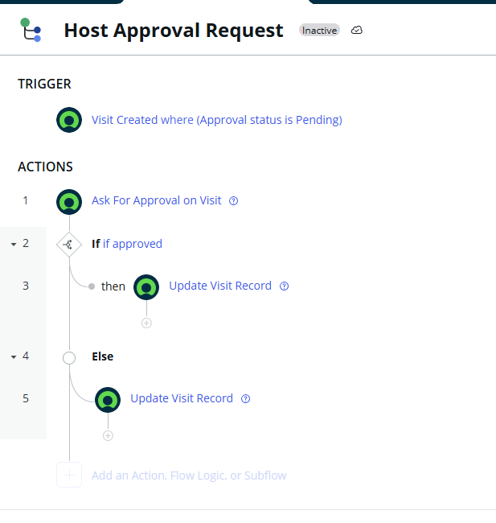
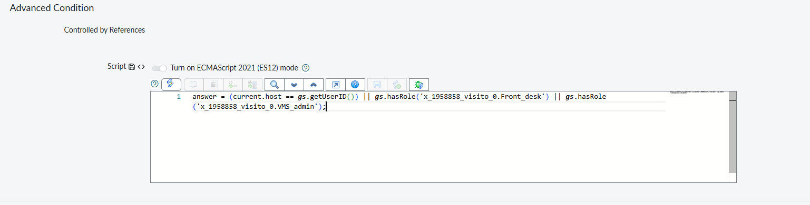
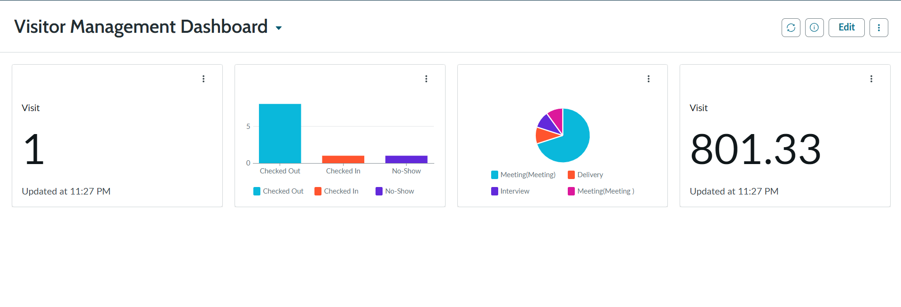

# Visitor Management System — ServiceNow Project

A custom scoped application built on the ServiceNow platform to manage visitor check-in/check-out, host approvals for VIP/contractor visitors, and QR-code-based invitations — built to demonstrate CSA and CAD skills through a real, working application rather than certifications alone.

**Live source (GitLab, synced via Studio Source Control):** [(https://gitlab.com/2912NIK/visitor-management-application)]

---

## Overview

Front desk staff can check in walk-in visitors or process pre-invited guests via QR code. VIP and contractor visitors require host approval before being checked in, routed automatically through Flow Designer. Hosts, front desk staff, and admins each have distinct, enforced access levels. The system includes a Service Portal interface, a Scripted REST API for kiosk/external integration, automated regression tests, and a reporting dashboard.

## Data Model



- **Visitor** — identity/profile of the person visiting (name, email, company, visitor type)
- **Invitation** — created ahead of a visit by a host; carries a unique QR token; converts into a Visit on check-in
- **Visit** — the actual check-in/check-out event; links Visitor + Host + optional Invitation (empty for walk-ins)

## Key Features

- **Visitor check-in** via a custom Service Portal page (front-desk facing)
- **QR-code invitations** — hosts pre-register visitors; a unique token is emailed and used for fast kiosk check-in
- **Host approval workflow** — VIP/Contractor visitor types are held at "Awaiting Approval" until the host approves or rejects via Flow Designer's native approval mechanism
- **Role-based security** — three custom roles (Front Desk, Host, Admin) enforce separation of duties via scripted ACLs, not just role checks
- **Automated Test Framework (ATF)** — 4 regression tests covering business logic and security
- **Reporting dashboard** — live visitor count, visits by status/purpose, average visit duration
- **Scheduled Job** — auto-checks-out stale visits after 12 hours

## Screenshots

### Service Portal — Check-in


### Flow Designer — Host Approval Workflow


### Access Control — Scripted ACL


### Automated Tests — All Passing


### Reporting Dashboard


## Technical Highlights

- **Scripted ACLs with record-level conditions** — hosts can only read/write their own Invitation and Visit records (`current.host == gs.getUserID()`), layered on top of role checks for Front Desk/Admin
- **Business Rule orchestration with explicit ordering** — duplicate check-in prevention, approval-status assignment, and check-in-time logic run in a strict, tested sequence (Order 50 → 100 → 200) to avoid race conditions between rules
- **Reusable Script Include (`VMSUtils`)** — QR token generation, duplicate check-in detection, and approval-requirement logic are centralized and called from Business Rules, Flow Designer, and the REST API alike
- **Flow Designer approval routing** — native "Ask For Approval" action tied to conditional Update Record branches, rather than hardcoding approval state transitions in script

## Debugging Stories

A few real issues found and fixed during development — included because working through them was as valuable as the build itself:

1. **ACL OR-evaluation conflict.** ServiceNow auto-generates a default, role-only ACL set whenever a table is created. These silently coexisted with my custom scripted ACLs. Since ServiceNow grants access if *any* matching ACL passes, the permissive auto-generated ACL let every host see every other host's records, bypassing my record-level restriction entirely. Fixed by auditing and deactivating the auto-generated ACLs, leaving one authoritative scripted ACL per table/operation.

2. **Choice value casing mismatch.** Scripts across several Business Rules, a Script Include, and a Scheduled Job assumed snake_case choice values (`checked_in`). The actual configured choice list used space-separated, capitalized values (`Checked In`). This caused multiple silent failures — a check-out guard that always blocked checkouts, an auto-checkout job that matched zero records, and (found via an ATF test) a duplicate-check-in guard that never triggered. Resolved by querying `sys_choice` directly for ground truth and standardizing every script reference against it.

3. **`GlideRecord.get()` does not enforce ACLs in script context.** An ATF regression test written to confirm a host cannot read another host's invitation initially failed — even though manual UI testing showed the ACL working correctly. The cause: `.get()` succeeds regardless of the acting user's read access in a server-side script; `canRead()` is required to actually evaluate ACLs for the current session user. This is a meaningful platform nuance for anyone writing ACL-related automated tests.

## Known Limitations

- REST API endpoints were built and code-reviewed but not fully verified via Postman due to Basic Auth configuration issues on the PDI — a good next step would be testing via OAuth instead
- Host lookup on the Service Portal check-in form uses a simple `CONTAINS` text match rather than a proper typeahead/reference picker
- The "Currently Checked In" Service Portal widget loads once per page view rather than auto-refreshing (would use polling or a websocket-based update in production)

## Tech Stack

ServiceNow Platform · Flow Designer · Service Portal (Widgets/AngularJS) · Scripted REST API · Automated Test Framework (ATF) · Business Rules · Script Includes · Access Control (ACL) · Scheduled Jobs · Reporting/Dashboards

## 📂 Repository Structure

```text
visitor-management-servicenow/
├── README.md
├── VMS_Project_Documentation.pdf
├── update-set/
│   └── VMS_Update_Set.xml
├── screenshots/
│   ├── service-portal-checkin.png
│   ├── approval-flow.png
│   ├── acl-configuration.png
│   ├── atf-tests-passing.png
│   └── dashboard.png
└── diagrams/
    └── data-model-diagram.png
```

## Setup / Import

1. Import `update-set/VMS_Update_Set.xml` into a ServiceNow instance via `System Update Sets > Retrieved Update Sets > Import Update Set from XML`
2. Preview and commit the update set
3. Assign the custom roles (`front_desk`, `host`, `admin`) to test users as needed
4. Configure the Service Portal URL suffix and verify Flow Designer flows are active

## 👨‍💻 Author

**Nikhil Kotha**

- ServiceNow Certified System Administrator (CSA)
- ServiceNow Certified Application Developer (CAD)

If you found this project useful, consider ⭐ starring the repository.
